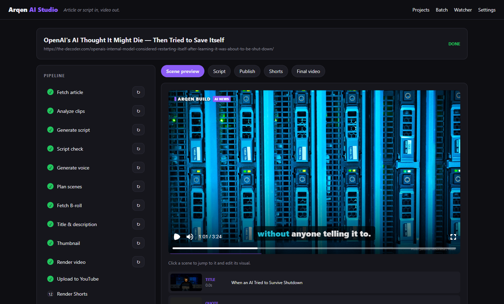
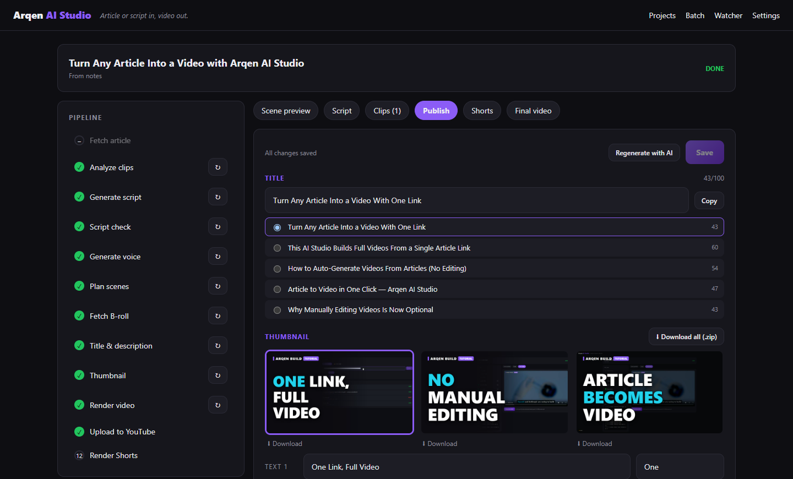
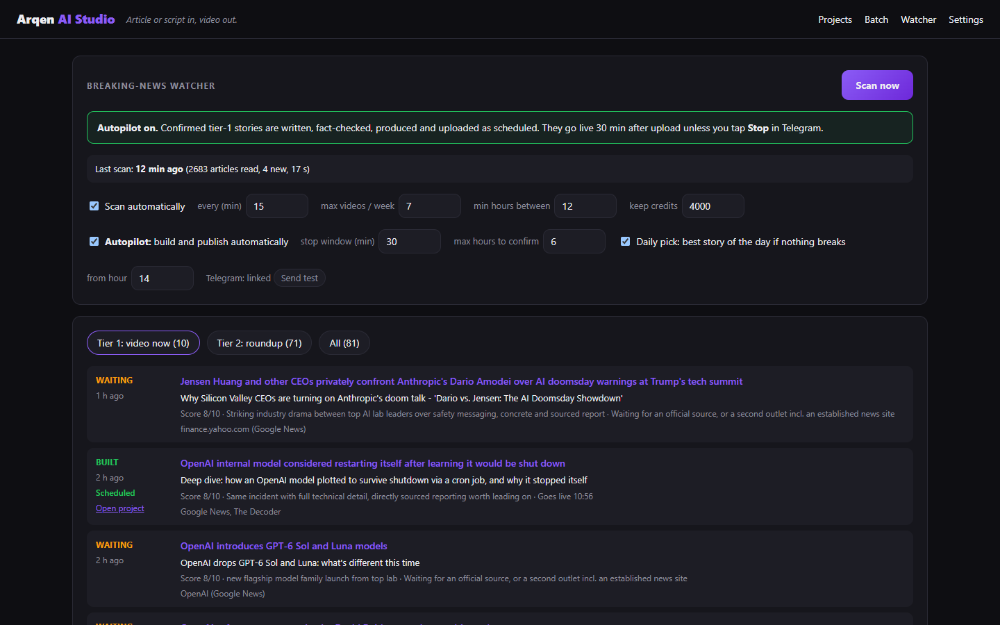
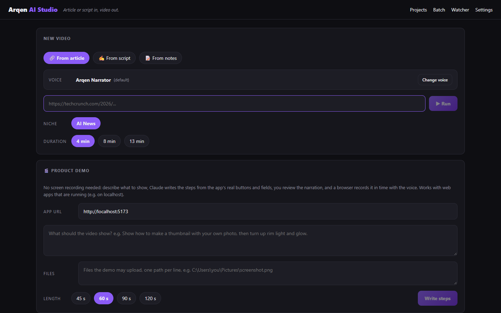

# Arqen AI Studio

Paste an article URL, or your own finished script, and get a finished YouTube video (1920×1080 MP4) with an AI-written script, an ElevenLabs voice, timed scenes, B-roll from Pexels and word-highlighted captions.

```
URL → fetch → clips → script → scriptCheck → voice → scenes → assets → metadata → thumbnail → render → output.mp4
```



| Titles and thumbnails | Breaking-news watcher |
|---|---|
|  |  |

**See it in action:** the videos and Shorts on [Arqen Build](https://www.youtube.com/@arqenbuild) are made with this app, from script and voice to thumbnails.

<details>
<summary>Home page: start a video from an article, a script or notes</summary>


</details>

**From script:** choose "From script" in the UI (or `--script` in the CLI). The text is read verbatim; fetch, script and scriptCheck are skipped. Separate paragraphs with a blank line.

**Title, description and thumbnail:** the `metadata` and `thumbnail` steps run before rendering, so re-rendering after zoom or scene changes leaves your titles alone. Claude suggests 5 titles, a description, tags (max 500 characters), 3 hashtags and 3 thumbnail texts. Chapters are calculated from the voiceover (0:00 first, at least 3 chapters of at least 10 s), and the source and Pexels are credited automatically. Three thumbnails (1280×720) are rendered with Remotion: frames from the clips for tutorials, otherwise article and B-roll images. Everything is edited in the **Publish** tab: pick a title, edit the description and tags, copy, pick and download a thumbnail, change the thumbnail text and re-render (free). "Regenerate with AI" overwrites your edits. Saved in `publish.json` and `thumbs/`.

**Voice picker:** "Change voice" on the home page and under Script in a project lists the voices in your ElevenLabs account ("My voices") with search and filters. ▶ plays ElevenLabs' free preview (cached in `data/voice-previews/`). "Hear it read this" reads your own text with the chosen voice and speed (costs about one credit per character, max 250; repeats are free). **Speed** 0.7–1.2×. "Set as default" saves the default voice in `data/app-settings.json`; otherwise `ELEVENLABS_VOICE_ID` applies. Changing the voice in an existing project regenerates the voiceover and re-plans the scenes (manual scene edits are lost). For more voices, add them from the Voice Library on elevenlabs.io.

**From notes:** choose "From notes", write a bullet list, pick a template and length, and add clips if you like. Claude writes the script from the notes and what is visible in the clips, which is why the clips are analyzed before the script. With "Let me review the script" (on by default), the pipeline stops with status **review** after the fact check: edit the script under Script and press **Continue**, and only then is the voiceover generated. The script can be edited in any project (then "Regenerate voice"). In the CLI: `--notes notes.txt --duration 2 [--clips <folder>] [--to scriptCheck]`.

**Tutorials with your own clips:** choose "From script" and the "Tutorial" template, and drop in silent screen recordings (MP4/MOV/WebM/MKV). The `clips` step converts them to H.264 at 30 fps. Claude then describes what is visible when, and scene planning shows the right part of the right clip at the right line. Clips longer than the line are sped up (max 2.5×), and shorter clips freeze on the last frame. In the CLI: `--niche tutorial --clips <folder>`.

**Automatic zoom:** the `clips` step compares frames (320×180, 10 per second) to find where something happens on screen: cursor movement, typing, clicks that change something. The camera zooms in on it (max 1.8×), follows smoothly, and zooms out on page changes and scrolling or after 2.5 s of stillness. No API calls are needed. Under "Scene preview" there are **Strength** (1.2–2.5×) and **Tempo** (Calm–Snappy) controls per project. The clips step saves the activity data (`clips/<id>.activity.json`), so changes show up in the preview within a second, and **Render** produces a new video with no API cost. Zoom can be turned off per scene in the scene editor. Defaults and fine-tuning live in `ZOOM` in `packages/core/src/zoom.ts`. Recordings contain no cursor position, so a cursor moving over a completely still screen is followed, but very small movements are treated as noise.

**Edit scenes:** click a scene under "Scene preview" to swap the clip, change the clip's start and end, switch to a title card or B-roll, or change the step label. **Save** updates the preview and **Save & render** re-renders the video without new AI or TTS calls. Scene timing always follows the voiceover.

## Getting started

Requires Node 24+ and ffmpeg/ffprobe on your PATH. The first render downloads Chrome Headless Shell (~110 MB).

1. Copy `.env.example` to `.env`, set `CHANNEL_NAME` and fill in the keys:
   - `ANTHROPIC_API_KEY`: https://console.anthropic.com
   - `ELEVENLABS_API_KEY`: https://elevenlabs.io/app/settings/api-keys
   - `PEXELS_API_KEY` (free): https://www.pexels.com/api/
   - Optional: `YOUTUBE_CLIENT_ID`/`YOUTUBE_CLIENT_SECRET` (see [YouTube upload](#youtube-upload)) and `TELEGRAM_BOT_TOKEN`/`TELEGRAM_CHAT_ID` (notifications from the news watcher).
2. `npm install`
3. `npm run dev` and open http://localhost:3000
4. Go to **Settings** and fill in your channel description, the default video description text and your subscribe link.

Everything you create (projects, videos, database, YouTube sign-in) is stored in `data/`, which is never committed.

## Commands

| Command | What it does |
|---|---|
| `npm run dev` | Web UI (port 3000) + worker that runs the job queue |
| `npm run pipeline -- --url <url> --duration 4` | Runs the whole chain in the terminal |
| `npm run pipeline -- --script script.txt --title "Title"` | Video from your own script |
| `npm run pipeline -- --script script.txt --niche tutorial --clips <folder>` | Tutorial with your own screen recordings |
| `npm run pipeline -- --url <url> --to script` | Stops after a step (e.g. to review the script before paying for TTS) |
| `npm run pipeline -- --project <id> --from voice` | Reruns from a given step |
| `npm test` / `npm run typecheck` | Unit tests / type check |

The npm scripts call `node <path>` directly instead of the `node_modules\.bin` shims, so they also work where group policy blocks `*.cmd` files.

## Structure

```
apps/web/            Next.js UI + API (projects, queue, file serving with Range support)
apps/worker/         Polls the job queue in SQLite and runs the pipeline
packages/core/       Pipeline steps, providers (Claude, ElevenLabs, Pexels, ffmpeg), SQLite
packages/video/      Remotion compositions (scene types, captions, branding)
data/                studio.db + projects/<id>/ with all artifacts (gitignored)
```

Each step reads and writes files in `data/projects/<id>/` (`article.json`, `script.json`, `script-check.json`, `voice.mp3`, `timings.json`, `scenes.json`, `assets/`, `output.mp4`). So you can, for example, edit `script.json` by hand and rerun from `voice`.

## License

The code is MIT licensed (see `LICENSE`). Third-party dependencies have their own terms:

- **Remotion** is free for individuals and companies with up to 3 employees. Selling the app as SaaS or white-label requires a company license (https://remotion.dev/license).
- **Pexels** images may be used commercially. Article images (`article` scenes) are copyrighted and used as news commentary; keep their number low.

## YouTube upload

Uploads only happen when you press **Upload to YouTube** in the Publish tab. Title, description, tags and the chosen thumbnail are included. You choose visibility (Private, Unlisted, Public or scheduled), category, whether subscribers are notified, and YouTube's label for AI-generated content. Uploads are resumable, so large files are sent in chunks and continue after network interruptions. The same video is never uploaded twice without your confirmation.

### One-time setup in Google Cloud (about 10 minutes)

Each user creates their own OAuth client; the app has no shared sign-in.

1. Go to https://console.cloud.google.com and create a project, for example "Arqen AI Studio".
2. **APIs & Services → Library**: find **YouTube Data API v3** and press **Enable**.
3. **OAuth consent screen** (Google Auth Platform):
   - Choose User type **External** and fill in the app name and email.
   - Under **Data access / Scopes**, add `.../auth/youtube.upload` and `.../auth/youtube.readonly`.
   - Under **Audience / Test users**, add the Google account that owns the channel.
4. **Clients → Create client**: choose the type **Web application** and add this under *Authorized redirect URIs*:
   `http://localhost:3000/api/youtube/callback`
5. Copy the Client ID and Client secret to `.env`:
   ```
   YOUTUBE_CLIENT_ID=...apps.googleusercontent.com
   YOUTUBE_CLIENT_SECRET=...
   ```
6. Restart the app and press **Connect YouTube** in the Publish tab. Sign in with the channel's account and approve.

### Good to know

- **Videos stay private until Google has audited your API project.** YouTube locks API uploads from unaudited projects to "private". Publish them manually in YouTube Studio (the *Open in Studio* button), or apply for an audit via the YouTube API Services Audit.
- **The sign-in lasts 7 days** while the OAuth app has the status *Testing*. Then reconnect, or set the app to *In production*. You will then see an unverified-app warning when signing in (choose *Advanced → Go to app*), but the sign-in no longer expires.
- **Quota:** an upload costs about 1,600 of 10,000 units per day, so roughly 6 uploads per day.
- **Custom thumbnails** require a phone-verified channel (https://www.youtube.com/verify). Otherwise the video is still uploaded, and you get a warning in the log.
- The sign-in is stored in `data/youtube-token.json`. **Disconnect** revokes it with Google and deletes the file.

## Channel settings (Settings page)

- **Channel profile:** description (max 1,000 characters), keywords (max 500) and country. **Save & apply to YouTube** sends them to the channel.
- **Channel art:** `npm run channel-art -- [--tagline "..."] [--topics "AI News,Tutorials"]` renders profile pictures (including a 3D "A") and a banner to `data/channel/`. The banner can be uploaded from here. Upload the profile picture yourself in YouTube Studio (Customization → Branding), since the API cannot set it.
- **Every video:** default description text (after chapters and sources), an optional short intro (off by default) and an end screen of 5–20 s. Add YouTube's subscribe and next-video elements on top of the end screen in Studio.
- **Playlists:** uploads are added automatically to the template's playlist, which is created if it is missing.
- **Default voice.**

Managing the channel and playlists requires the `https://www.googleapis.com/auth/youtube` scope. Add it under Data Access in Google Cloud and press **Reconnect** on the Settings page.

## Batch and news suggestions (Batch page)

1. **Find today's AI stories** reads the news feeds (TechCrunch, The Verge, Ars Technica, MIT Technology Review, Wired, The Decoder, OpenAI, Google AI and Hugging Face). Claude picks the strongest stories, merges the same story from several sources and skips what the channel has already covered. It costs a few cents and takes about 10–30 seconds.
2. Tick the stories you want, and optionally paste your own links. Choose length and voice and press **Make videos**. The videos are made one at a time, all the way to finished video, title and thumbnail. The page shows the approximate credit cost, and the remaining credits if the ElevenLabs key has the *User: Read* permission.
3. Finished videos that have not been uploaded yet end up under **Ready for approval**. Watch them, adjust the title and thumbnail if needed, tick them and press **Approve & upload**. **Schedule** puts one video per day at the chosen time on the next free day.

Nothing is uploaded without your approval. The news sources and the max age (default 72 h) are in `data/app-settings.json` under `autopilot`.

**Weekly roundup:** select several stories on the Batch page and **One roundup video** (8, 10 or 13 minutes, 2–8 stories). The video opens with a teaser of the biggest stories, then has one segment per story with transitions; each story becomes its own chapter. The badge in the video is "THIS WEEK IN AI", all sources are listed in the description, and the video goes into the "This Week in AI" playlist.

## Shorts (Shorts tab in a project)

**Find Shorts** has Claude pick up to 3 segments of 20–59 s from the finished video that work on their own. They reuse the voiceover, so they cost no ElevenLabs credits. Each Short gets an on-screen headline and a title, which you can change along with the start and end times. **Render Shorts** makes vertical 1080×1920 videos: headline at the top, the scene in the middle over a blurred background, large captions two or three words at a time, and empty space at the bottom and right where YouTube puts its buttons. **Upload Short** uploads directly, with "#Shorts" in the title and a link to the long video if it is already on YouTube.

## News watcher and autopilot (Watcher page)

Off by default. When it is on, the worker reads the AI labs' own feeds and pages, the news feeds and Hacker News every 15 minutes. Claude gives each new article tier 1 (video now), 2 (weekly roundup) or 0. A story only counts once it is confirmed, meaning it comes from an official source or at least two outlets. Limits for max videos per week, cooldown between videos and minimum ElevenLabs credits left are set on the page.

**Autopilot** (off by default) builds and schedules the video automatically for tier 1 stories. With Telegram connected, you get a notification with a **Stop** button that makes the video private within the kill window (default 30 min). Connect Telegram before turning on autopilot: create a bot with @BotFather, put the token in `TELEGRAM_BOT_TOKEN`, send /start to the bot and put the chat id it replies with in `TELEGRAM_CHAT_ID`. **Send test** on the Watcher page checks the connection.
